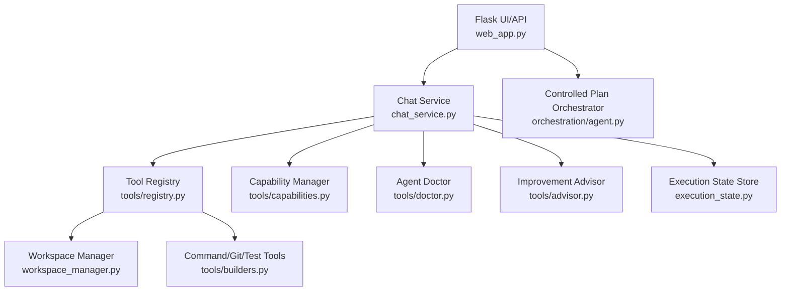

# Coding Agent

Production-focused autonomous coding agent scaffold based on your specification.

## Current milestone

Implemented **FIRST RUN** workflow:
- Repository discovery and architecture mapping
- Baseline verification command discovery + optional execution
- Working/incomplete capability assessment
- Risk and technical debt extraction
- Recommended smallest next milestone
- No target repository file modification during discovery mode

Implemented **controlled execution milestone**:
- Task graph loading with dependency validation
- Controlled task execution (`command` then `validate_command`)
- Failure classification and bounded repair loop
- Repair budget per task with BLOCKED/FAILED completion gate

## Quick start

```powershell
cd coding-agent
python -m venv .venv
.\.venv\Scripts\Activate.ps1
pip install -r requirements.txt
pip install -e .
coding-agent first-run --repo ..\eai-7536-countrycxs
```

## Chat UI (prompt window)

Start local UI:

```powershell
coding-agent-ui
```

Open:

```text
http://127.0.0.1:5050
```

From the chat page you can:
- paste prompt text in the textarea
- set repo path and output report path
- run conversational chat with session memory (Copilot-style prompt/response flow)
- trigger execution explicitly with `/run first-run` or `/run run-plan`
- optionally enable **Execute selected mode on send** for immediate execution
- run `first-run` and `run-plan` using mode settings, plan path, and resume options
- rotate checkpoint key from UI
- view async progress status + timeline details while job is running
- provide file parameters using prompt file upload, context file uploads, and repo-relative context file paths
- view project reference path where this app is created
- download repo source code as `.zip` from UI

## LLM layer policy (current)

- No external LLM integration is enabled by default.
- No Ollama/OpenAI/Azure dependencies are installed for runtime inference.
- The project includes an abstraction-only reasoning layer for future plug-in.

Implemented abstraction modules:
- `src/coding_agent/reasoning/types.py`
- `src/coding_agent/reasoning/router.py`
- `src/coding_agent/reasoning/provider.py`

Current default behavior:
- `ModelRouter` applies hardware-aware routing heuristics:
	- easy tasks -> `Qwen2.5-Coder-3B-Instruct Q4` profile
	- medium/hard local tasks -> `Qwen2.5-Coder-7B-Instruct Q4` profile
	- cloud fallback remains disabled by policy
- `LLMGateway` uses `NullLLMProvider` until a real provider is registered.

You can inspect routing decisions via API (no model call):

```text
POST /api/reasoning/route
```

## VS Code configurable agent

This project now supports a workspace-configurable execution model for VS Code.

### Workspace config

Edit:

```text
.vscode/coding-agent.json
```

Key fields:
- `mode`: `first-run` | `run-plan` | `rotate-key`
- `repo`: target repository path
- `output`: report output path
- `plan_file`: required for `run-plan`
- `max_repair_attempts_per_task`, `resume_*` controls for run-plan

### Run from terminal using config

```powershell
coding-agent run-config --config .vscode/coding-agent.json
```

Optional mode override:

```powershell
coding-agent run-config --config .vscode/coding-agent.json --mode run-plan
```

### Run from VS Code

- Open **Command Palette** → **Tasks: Run Task**
	- `Coding Agent: Run Config`
	- `Coding Agent: Run Config (first-run)`
	- `Coding Agent: Run Config (run-plan)`
	- `Coding Agent: Rotate Key`
	- `Coding Agent: UI`

Debug launch profiles are also provided in `.vscode/launch.json`.

## Export and install on a different machine

Yes, this agent can be exported and installed on another machine running VS Code.

### 1) Export on source machine

From project root:

```powershell
.\scripts\export-agent.ps1 -OutputZip coding-agent-portable.zip
```

This creates a portable zip containing source, tests, examples, `.vscode` tasks/launch config, and docs.

### 2) Copy and extract on target machine

- Copy `coding-agent-portable.zip` to target machine
- Extract into a folder (for example `C:\dev\coding-agent`)
- Open that folder in VS Code

### 3) Install dependencies on target machine

From the extracted project root:

```powershell
.\scripts\install-agent.ps1 -ProjectPath . -RunTests
```

If editable install fails with a file-lock error, close running `coding-agent-ui` / Python terminals and re-run the installer.

### 4) Run in VS Code

- Use **Tasks: Run Task**:
	- `Coding Agent: UI`
	- `Coding Agent: Run Config`
- Or run from terminal:

```powershell
.venv\Scripts\coding-agent run-config --config .vscode/coding-agent.json
```

### Prerequisites on target machine

- Python `3.10+`
- VS Code
- Recommended extension: `ms-python.python`

Run with baseline command execution:

```powershell
coding-agent first-run --repo ..\eai-7536-countrycxs --run-baseline
```

Save report:

```powershell
coding-agent first-run --repo ..\eai-7536-countrycxs --output reports\assessment.md
```

Run a controlled plan with repair budget:

```powershell
coding-agent run-plan --repo . --plan-file examples\simple-plan.json --max-repair-attempts-per-task 2 --output reports\plan-run.md
```

Resume an interrupted or blocked plan:

```powershell
coding-agent run-plan --repo . --plan-file examples\simple-plan.json --resume-latest --output reports\plan-resume.md
```

Preview resume queue without executing commands:

```powershell
coding-agent run-plan --repo . --plan-file examples\simple-plan.json --resume-latest --resume-dry-run --resume-max-risk 3 --output reports\resume-preview.md
```

Resume preview includes retry risk scoring (`LOW|MEDIUM|HIGH`) and reasons for each retried task.
Resume preview also includes per-task repair recommendations.

Or resume by explicit run ID:

```powershell
coding-agent run-plan --repo . --plan-file examples\simple-plan.json --resume-run-id <run-id>
```

Structured JSONL logs are written under `.agent_logs/<run-id>.jsonl` and include per-task duration metrics (`duration_ms`) on completion/failure events.

Checkpoint data now uses HMAC-signed envelopes (`HMAC-SHA256`). If checkpoint state is tampered, resume is blocked with an integrity-check forensic report.

When integrity mismatch is detected, the command returns a forensic report with expected/actual hash details and checkpoint task IDs.

Rotate checkpoint signing key (keeps backward verification for previously signed checkpoints):

```powershell
coding-agent rotate-key --output reports\key-rotation.md
```

Checkpoint envelope versioning:
- `v2`: HMAC signature + `key_id` (current default)
- `v1`: HMAC signature without `key_id` (supported for backward compatibility)
- legacy: plain `hash` envelope (still verifiable for backward compatibility)

Risk-threshold policy:

```powershell
coding-agent run-plan --repo . --plan-file examples\resume-blocked-plan.json --resume-latest --resume-max-risk 3 --output reports\resume-policy-block.md
```

If retry tasks exceed the threshold, execution is blocked and a policy report is returned.

## Safety defaults

- Discovery mode performs read-only repository inspection.
- Destructive shell operations are blocked.
- Target writes are blocked in FIRST RUN mode.

## Project structure

- `src/coding_agent/main.py` CLI entrypoint
- `src/coding_agent/orchestration/agent.py` orchestration loop (moved)
- `src/coding_agent/presentation/web_app.py` Flask UI/API (moved)
- `src/coding_agent/presentation/chat_service.py` conversational layer (moved)
- `src/coding_agent/reasoning/` model routing + provider abstraction (no runtime integration)
- `src/coding_agent/execution/` task graph, command runner, repair, verifier (moved)
- `src/coding_agent/governance/` safety, lifecycle, integrity (moved)
- `src/coding_agent/composition.py` layer composition root
- `src/coding_agent/layers/` architecture contracts + integration mapping
- `src/coding_agent/repo_intel.py` repository intelligence
- `src/coding_agent/planner.py` next-milestone selection
- `src/coding_agent/state_store.py` lifecycle persistence
- `src/coding_agent/reporting.py` final assessment rendering
- `tests/` unit tests

Compatibility shims retained for import stability:
- `src/coding_agent/web_app.py`
- `src/coding_agent/agent.py`
- `src/coding_agent/executor.py`
- `src/coding_agent/task_graph.py`
- `src/coding_agent/command_runner.py`
- `src/coding_agent/repair.py`
- `src/coding_agent/verifier.py`
- `src/coding_agent/safety.py`
- `src/coding_agent/lifecycle.py`
- `src/coding_agent/integrity.py`

## Pre-LLM development roadmap (recommended)

Before integrating any real LLM runtime, complete these steps:

1. **Context quality pipeline**
	- Add symbol index + semantic retrieval adapter behind `CodeSearchPort`
	- Add context packing policy with token budget telemetry
2. **Structured editing engine**
	- Introduce safe edit operations (method replace/insert/import add)
	- Add file-level rollback checkpoints for failed edits
3. **Sandbox hardening**
	- Move command execution into containerized runner profile
	- Enforce command allowlist policy and path-scoped write controls
4. **Validation depth**
	- Add staged validation (`build -> unit -> integration -> static checks`)
	- Add deterministic retry policy by failure class
5. **Governance and audit**
	- Add action approval gates for high-impact operations
	- Expand JSONL event schema to include policy decisions and costs
6. **Persistence and reliability**
	- Persist chat/job state for restart-safe operation
	- Add run replay artifacts for post-incident debugging

Architecture references:
- `LAYERED_AGENT_ARCHITECTURE.md` (12-layer integration model mapped to current code)
- `TECHNICAL_IMPLEMENTATION_DOCUMENT.md` (full implementation detail)
- `LOCAL_MODEL_ROUTING_STRATEGY.md` (hardware-aware model routing abstraction)

## End-to-end coding agent capabilities

The agent now supports dynamic, workspace-aware execution with structured tools:

- File operations: read, create, write, edit, delete, rename, list, search files, search text
- Execution: run controlled commands and auto-detect test commands
- Git: status, diff, log, branch list/create, checkout, add, commit (approval-gated)
- Diagnostics: dynamic `/tools`, `/capabilities`, `/status`, `/doctor`
- Advisor: natural-language self-improvement analysis (`How can I improve you?`)
- State: structured execution state returned in chat responses for UI rendering

## Architecture (incremental)



## Tool architecture

- `ToolRegistry`: centralized registration and execution contract
- `ToolDefinition`: name, description, parameters, safety, execution callback
- `register_default_tools(...)`: mounts filesystem, execution, test, and git tools
- `CapabilityManager`: computes capabilities from actually-registered tools
- `AgentDoctor`: reports health from real runtime/tooling availability

## Workspace security model

- Security boundary is workspace path, not file extension
- `WorkspaceManager` enforces normalized, traversal-safe path resolution
- Operations outside workspace are blocked with explicit errors
- Command safety policy blocks known-dangerous commands and enforces allowlist
- Destructive operations require explicit approval inputs

## Execution modes

Configured through environment variable `CODING_AGENT_EXECUTION_MODE`:

- `safe`: read/search by default; write actions require approval flags
- `auto` (default): create/modify and test workflows enabled with safety checks
- `full`: broader autonomy; destructive actions still require explicit confirmation

## Supported workflows

- Conversational request understanding + workspace inspection
- Dynamic planning/activity output in chat (`activity`, `tool_results`, `state`)
- End-to-end file creation/modification + execution when request implies action
- Git change inspection from natural language (`Show me what changed in Git`)

## How to add a new tool

1. Implement executor function returning structured dict result
2. Register via `ToolRegistry.register(ToolDefinition(...))`
3. Add capability mapping in `CapabilityManager` if needed
4. Add tests in `tests/` for success and safety failure paths

## How to add a new capability

1. Add/compose tools that implement the capability
2. Update `CapabilityManager` section mapping
3. Extend `/doctor` checks if it affects health reporting
4. Add endpoint/chat tests validating runtime discoverability

## How to run tests

```powershell
python -m pytest -q
```

## Example conversations

- `What can you do?`
- `/tools`
- `/doctor`
- `Show me the project structure`
- `Find where authentication is implemented`
- `Create a file called hello.md containing a short description of this project.`
- `Create a Python file called hello.py that prints Hello World.`
- `Modify hello.py to accept a name.`
- `Show me what changed in Git.`

## Latest architecture and implementation updates (2026-09-26)

- Added secure workspace filesystem manager for path-bounded file operations.
- Added centralized tool registry and dynamic capability/doctor/advisor features.
- Added approval-token workflow for destructive actions (`delete_file`, `git_commit`).
- Added persistent semantic index with rebuild API and indexed semantic search.
- Added optional provider-backed LLM integration path with telemetry auditing.
- Added deeper repair strategies (multi-file init patch + retry proposals).
- Added guide page (`/guide`) and one-click acceptance execution (`/api/acceptance/run`).
- Added Copilot-parity benchmark automation report script.
